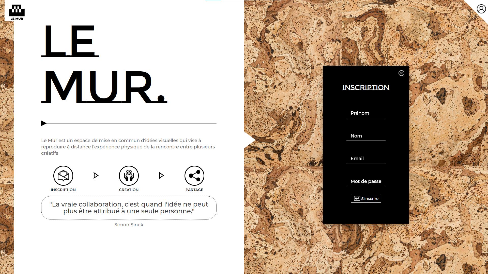

# Le Mur
Le Mur est une application de travail collaborative, permettant à des personnes distantes de travailler sur un même document visuel.

## Démarrer le projet

***Démarrage du serveur Node:***
- construire la base PSQL et l'utilisateur à l'aide du script 'create_db.sql' dans BACK/data/
- construire les tables de la base à l'aide des scripts Sqitch dans 'BACK/data/migrations'
- lancer la commande 'node index.js' dans BACK/API-omur, le serveur se lance sur localhost:3000

***Démarrage de la partie Front-end***
- lancer la commande 'npm start' dans le dossier 'FRONT', le serveur démarre sur localhost:8080

## Technologies
BACK: Node / PostgresQL / Express / Sqitch
librairies back: Multer, Bcrypt, fs-extra, Jsonwebtoken

FRONT: React
librairies front: Axios, Sass, Redux, autocomplete, file-saver, Formik, Quill-to-pdf, React-photo-gallery, url-loader 

## Apercu de le page d'accueil
